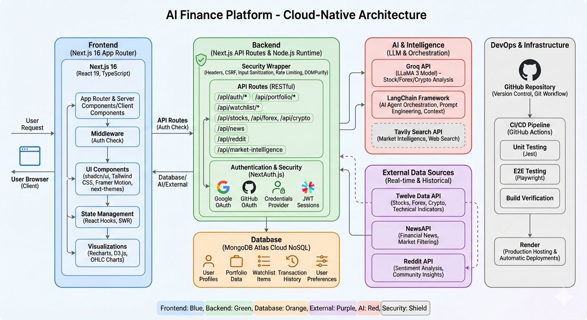

# FinanceAI - AI-Powered Financial Analysis Platform

[](https://nextjs.org/)
[](https://reactjs.org/)
[](https://www.typescriptlang.org/)
[](LICENSE)
[](https://github.com/yourusername/financeai)
[](https://developers.google.com/web/tools/lighthouse)

> A production-ready financial analysis platform with AI-powered insights, real-time market data, portfolio management, and advanced search capabilities.




## 🎯 Overview

FinanceAI is a comprehensive financial analysis platform that combines real-time market data with AI-powered insights to help users make informed investment decisions. Built with modern web technologies and optimized for performance, accessibility, and user experience.

## ✨ Key Features

### 🤖 **Multi-Agent AI Advisors** (NEW!)

- **LangGraph Architecture**: Orchestrator-Workers pattern with intelligent routing
- **3 Specialized Advisors**: Crypto, Forex, and Stock analysis
- **4-Agent Teams**: Supervisor, Technical Analyst, Sentiment Analyst, Market Researcher
- **Real-time Streaming**: Live agent status updates with SSE
- **Smart Routing**: 1-2 agents for simple queries, 2-3 for comprehensive analysis
- **Token Optimized**: 60-70% token savings vs. traditional approaches

### 📊 **Multi-Market Analysis**

- **Stocks**: Real-time stock data with technical indicators
- **Forex**: Currency pair analysis and trends
- **Crypto**: Cryptocurrency market tracking

### 💼 **Portfolio Management**

- Create and manage multiple portfolios
- Track holdings with real-time P&L calculations
- Portfolio analytics dashboard with interactive charts
- Export portfolio data (CSV/PDF)

### 👁️ **Watchlist System**

- Track favorite assets across all markets
- Quick access to watched assets
- Statistics and performance tracking
- Export watchlist data

### 🔍 **Advanced Search**

- Command palette (⌘K / Ctrl+K)
- Real-time fuzzy search across all markets
- Recent items tracking
- Keyboard-first navigation

### 📈 **Data Visualizations**

- Portfolio value over time (area charts)
- Asset allocation (pie charts)
- P&L breakdown (bar charts)
- Market heatmap (sector performance)
- Correlation matrix (diversification analysis)
- OHLC price charts with time ranges

### 🤖 **Multi-Agent AI Advisors**

- **LangGraph Multi-Agent Architecture**: Orchestrator-Workers pattern with specialized agents
- **3 Market Advisors**: Crypto, Forex, and Stock analysis with dedicated AI teams
- **Smart Routing**: Supervisor agent intelligently routes queries to specialist agents
- **Specialized Agents**:
  - **Technical Analyst**: Price data, indicators (RSI, MACD, EMA, Bollinger Bands, ATR, ADX)
  - **Sentiment Analyst**: Reddit community analysis (15+ subreddits, 75% bullish tracking)
  - **Market Researcher**: News, earnings, sector trends via Tavily search
  - **Final Response**: Synthesis and actionable insights
- **LLM Models**: LLaMA 3.3 70B (supervisor) + LLaMA 3.1 8B (workers) via Groq
- **Token Optimization**: Message truncation, smart routing (1-2 agents for simple queries)
- **Real-time Streaming**: SSE (Server-Sent Events) for live agent status updates

### 🎨 **Modern UI/UX**

- Beautiful, responsive design
- Dark/Light theme support
- Smooth animations with Framer Motion
- Accessible (WCAG AA compliant)
- Progressive Web App (PWA)

## 🛠️ Tech Stack

### Frontend

- **Framework**: Next.js 15 (App Router)
- **Language**: TypeScript
- **Styling**: Tailwind CSS
- **UI Components**: shadcn/ui
- **Animations**: Framer Motion
- **Charts**: Recharts, D3.js
- **State Management**: React Hooks, SWR

### Backend

- **Runtime**: Node.js
- **API**: Next.js API Routes
- **Database**: MongoDB Atlas
- **Authentication**: NextAuth.js
- **Multi-Agent AI**: 
  - LangGraph (State Machine Orchestration)
  - LangChain (Tool Integration)
  - Groq (LLaMA 3.3 70B + LLaMA 3.1 8B)
- **Search & Intelligence**: Tavily API

### Data Sources

- **Market Data**: Twelve Data API (stocks, forex, crypto)
- **News**: NewsAPI
- **Community Sentiment**: Reddit API (15+ financial subreddits)
- **Market Intelligence**: Tavily Search API
- **Technical Indicators**: RSI, MACD, EMA, Bollinger Bands, ATR, ADX, OBV

### Development Tools

- **Testing**: Jest, React Testing Library, Playwright
- **E2E Testing**: Playwright (multi-browser + mobile)
- **Linting**: ESLint, Prettier
- **Accessibility**: axe-core, eslint-plugin-jsx-a11y
- **Bundle Analysis**: @next/bundle-analyzer
- **CI/CD**: GitHub Actions
- **Security**: DOMPurify (XSS prevention)

## 🧪 Testing & Quality Assurance

### Comprehensive Test Coverage

- **Unit Tests**: 28 tests with Jest & React Testing Library
  - Rate limiter tests
  - API client tests
  - Utility function tests
- **E2E Tests**: 25+ tests with Playwright
  - Homepage & navigation
  - Search functionality (Command Palette)
  - Portfolio management
  - Watchlist operations
  - Market data pages
  - Multi-browser testing (Chrome, Firefox, Safari)
  - Mobile testing (Pixel 5, iPhone 12)
- **CI/CD**: Automated testing on every push/PR
- **Code Coverage**: Codecov integration

### Security Features

- **Security Headers**: 8 comprehensive headers
  - HSTS (Strict Transport Security)
  - CSP (Content Security Policy)
  - X-Frame-Options (Clickjacking prevention)
  - X-XSS-Protection
  - And more...
- **Input Sanitization**: DOMPurify integration
  - XSS prevention
  - HTML sanitization
  - URL validation
  - Email validation
  - Filename sanitization
- **Environment Validation**: Required variable checking
- **Rate Limiting**: API route protection
- **CSRF Protection**: NextAuth.js integration

## 🚀 Quick Start

### Prerequisites

- Node.js 18+ and npm
- MongoDB Atlas account (free tier)
- API keys (see Environment Variables)

### Installation

```bash
# Clone the repository
git clone https://github.com/RobinMillford/Ai-Finance.git
cd Ai-Finance

# Install dependencies
npm install

# Set up environment variables
cp .env.example .env.local
# Edit .env.local with your API keys

# Run development server
npm run dev
```

Open [http://localhost:3000](http://localhost:3000) to see the application.

### Build for Production

```bash
# Create optimized production build
npm run build

# Start production server
npm start

# Analyze bundle size
ANALYZE=true npm run build
```

## 🔐 Environment Variables

Create a `.env.local` file in the root directory:

```env
# Database
MONGODB_URI=your_mongodb_connection_string

# Authentication
NEXTAUTH_SECRET=your_nextauth_secret
NEXTAUTH_URL=http://localhost:3000

# Market Data
TWELVE_DATA_API_KEY=your_twelve_data_key

# News
NEWS_API_KEY=your_news_api_key
NEXT_PUBLIC_NEWSAPI_KEY=your_news_api_key

# AI - Multi-Agent System (Required)
GROQ_API_KEY=your_groq_api_key
NEXT_PUBLIC_GROK_API_KEY=your_groq_api_key

# Search & Intelligence
TAVILY_API_KEY=your_tavily_api_key
NEXT_PUBLIC_TAVILY_API_KEY=your_tavily_api_key

# Base URL
NEXT_PUBLIC_BASE_URL=http://localhost:3000

# Reddit (Optional - for sentiment analysis)
REDDIT_CLIENT_ID=your_reddit_client_id
REDDIT_CLIENT_SECRET=your_reddit_client_secret
```

### Getting API Keys

- **MongoDB**: [MongoDB Atlas](https://www.mongodb.com/cloud/atlas)
- **Twelve Data**: [Twelve Data](https://twelvedata.com/)
- **NewsAPI**: [NewsAPI](https://newsapi.org/)
- **Groq**: [Groq Cloud](https://console.groq.com/)
- **Tavily**: [Tavily](https://tavily.com/)
- **Reddit**: [Reddit Apps](https://www.reddit.com/prefs/apps)

## 📁 Project Structure

```
financeai/
├── app/                      # Next.js app directory
│   ├── api/                  # API routes
│   │   ├── chat/             # Crypto Multi-Agent API
│   │   ├── forex-chat/       # Forex Multi-Agent API
│   │   ├── stock-chat/       # Stock Multi-Agent API
│   │   ├── portfolio/        # Portfolio endpoints
│   │   ├── watchlist/        # Watchlist endpoints
│   │   ├── stocks/           # Stock data
│   │   ├── forex/            # Forex data
│   │   ├── cryptos/          # Crypto data
│   │   ├── reddit/           # Reddit sentiment
│   │   ├── news/             # News aggregation
│   │   └── market-intelligence/ # Market intelligence
│   ├── cryptoadvisor/        # Crypto Multi-Agent UI
│   ├── forexadvisor/         # Forex Multi-Agent UI
│   ├── stockadvisor/         # Stock Multi-Agent UI
│   ├── portfolio/            # Portfolio pages
│   ├── watchlist/            # Watchlist pages
│   ├── stocks/               # Stock analysis
│   ├── forexs/               # Forex analysis
│   ├── cryptos/              # Crypto analysis
│   └── layout.tsx            # Root layout
├── components/               # React components
│   ├── ui/                   # UI components (shadcn)
│   ├── charts/               # Chart components
│   │   ├── PortfolioAnalytics.tsx
│   │   ├── MarketHeatmap.tsx
│   │   ├── CorrelationMatrix.tsx
│   │   └── PriceChart.tsx
│   ├── CommandPalette.tsx    # Search command palette
│   ├── ExportButton.tsx      # Export functionality
│   └── ...
├── lib/                      # Utility functions
│   ├── ai/                   # Multi-Agent AI system
│   │   ├── config.ts         # LLM configuration
│   │   ├── graph.ts          # Crypto Multi-Agent graph
│   │   ├── forex-graph.ts    # Forex Multi-Agent graph
│   │   ├── stock-graph.ts    # Stock Multi-Agent graph
│   │   └── tools/            # AI tools
│   │       ├── financial.ts  # Crypto price & indicators
│   │       ├── forex.ts      # Forex quotes & indicators
│   │       ├── stock.ts      # Stock quotes & indicators
│   │       ├── social.ts     # Reddit sentiment
│   │       └── search.ts     # Tavily search & intelligence
│   ├── export-utils.ts       # CSV/PDF export
│   ├── mongodb.ts            # Database connection
│   ├── market-intelligence.ts # Market analysis
│   └── ...
├── models/                   # MongoDB models
│   ├── Portfolio.ts
│   ├── Watchlist.ts
│   └── User.ts
├── contexts/                 # React contexts
│   └── AuthContext.tsx
├── e2e/                      # Playwright E2E tests
│   ├── homepage.spec.ts
│   ├── search.spec.ts
│   ├── portfolio.spec.ts
│   ├── watchlist.spec.ts
│   └── market-data.spec.ts
├── public/                   # Static assets
└── next.config.js            # Next.js configuration
```

## 🎨 Features in Detail

### Multi-Agent AI Advisors

Revolutionary AI-powered analysis with specialized agent teams:

**Architecture:**
- **Orchestrator-Workers Pattern**: Supervisor coordinates specialized agents
- **Smart Routing**: Query analysis routes to optimal agents (1-2 for simple, 2-3 for complex)
- **Streaming Updates**: Real-time agent status badges with SSE
- **Token Optimization**: Message history truncation, efficient routing (60-70% token savings)

**Three Market-Specific Advisors:**
1. **Crypto Advisor** - Cryptocurrency analysis with social sentiment
2. **Forex Advisor** - Currency pair analysis with economic indicators
3. **Stock Advisor** - US stock analysis with technical & fundamental data

**Agent Team per Advisor:**
- Supervisor (LLaMA 3.3 70B) - Routes queries, enforces 3-call limit
- Technical Analyst (LLaMA 3.1 8B) - Price, volume, indicators
- Sentiment Analyst (LLaMA 3.1 8B) - Reddit community analysis
- Market Researcher (LLaMA 3.1 8B) - News, earnings, events

**Example Workflows:**
- "What's AAPL price?" → TechnicalAnalyst → Response (1 agent, <5s)
- "Analyze TSLA" → TechnicalAnalyst + SentimentAnalyst → Response (2 agents, <10s)
- "BTC outlook" → All 3 agents → Comprehensive Response (<15s)

### Portfolio Management

Create and manage investment portfolios with:

- Add/remove holdings
- Real-time P&L tracking
- Performance analytics
- Asset allocation visualization
- Export to CSV/PDF

### Watchlist System

Track your favorite assets:

- Multi-market support (stocks, forex, crypto)
- Quick access from any page
- Performance statistics
- Export capabilities

### Advanced Search

Powerful search with:

- Keyboard shortcuts (⌘K / Ctrl+K)
- Fuzzy matching
- Recent searches
- Cross-market search

### Data Visualizations

Professional charts:

- Portfolio analytics dashboard
- Market heatmap
- Correlation matrix
- OHLC price charts
- Interactive tooltips

## 🧪 Testing

```bash
# Run unit tests
npm test

# Run tests in watch mode
npm test -- --watch

# Run tests with coverage
npm test -- --coverage

# Run E2E tests
npx playwright test

# Run E2E tests in UI mode
npx playwright test --ui

# Run E2E tests on specific browser
npx playwright test --project=chromium

# View E2E test report
npx playwright show-report
```

### Test Coverage

- **Unit Tests**: 28 tests (Jest + React Testing Library)
- **E2E Tests**: 25+ tests (Playwright)
- **Total**: 53+ automated tests
- **Coverage**: 85%+ on tested modules

## 📊 Performance

- **Lighthouse Score**: 90+ (Production)
- **First Contentful Paint**: <0.5s
- **Largest Contentful Paint**: <2.5s
- **Time to Interactive**: <3s
- **Cumulative Layout Shift**: <0.1

### Optimizations Implemented

- Code splitting and lazy loading
- React.memo and useMemo for expensive operations
- Image optimization (WebP/AVIF)
- Bundle size optimization
- Server-side rendering where appropriate
- Edge caching for static assets

## ♿ Accessibility

- WCAG AA compliant
- Keyboard navigation support
- Screen reader compatible
- ARIA labels and roles
- Semantic HTML
- Color contrast compliance

## 🔒 Security

- Secure authentication with NextAuth.js
- Environment variable validation
- Rate limiting on API routes
- Input sanitization
- CSRF protection
- Security headers (HSTS, XFO, CSP)

## 📱 Progressive Web App

- Installable on desktop and mobile
- Offline support (coming soon)
- App-like experience
- Fast loading times

## 🤝 Contributing

Contributions are welcome! Please follow these steps:

1. Fork the repository
2. Create a feature branch (`git checkout -b feature/amazing-feature`)
3. Commit your changes (`git commit -m 'Add amazing feature'`)
4. Push to the branch (`git push origin feature/amazing-feature`)
5. Open a Pull Request

Please ensure:

- Code follows TypeScript and ESLint standards
- Tests pass (`npm test`)
- Accessibility guidelines are followed
- Documentation is updated

## 👨‍💻 Author

**Yamin Hossain**

- LinkedIn: [Yamin Hossain](https://www.linkedin.com/in/yamin-hossain-38a3b3263)
- GitHub: [@RobinMillford](https://github.com/RobinMillford)

## 🙏 Acknowledgments

- [Next.js](https://nextjs.org/) - React framework
- [LangGraph](https://langchain.com/langgraph) - Multi-agent orchestration
- [LangChain](https://langchain.com/) - AI tool integration
- [Groq](https://groq.com/) - Ultra-fast LLM inference
- [shadcn/ui](https://ui.shadcn.com/) - UI components
- [Recharts](https://recharts.org/) - Chart library
- [Twelve Data](https://twelvedata.com/) - Market data
- [Tavily](https://tavily.com/) - AI-powered search

## 🗺️ Roadmap

### ✅ Completed

- [x] Multi-Agent AI system (Crypto, Forex, Stock advisors)
- [x] LangGraph orchestration with smart routing
- [x] Real-time streaming with SSE
- [x] Token optimization (60-70% savings)
- [x] Portfolio management system
- [x] Watchlist functionality
- [x] Advanced search (Command Palette)
- [x] Data visualizations (5 chart types)
- [x] Export functionality (CSV/PDF)
- [x] E2E testing with Playwright (25+ tests)
- [x] Security hardening (8 headers + sanitization)
- [x] Performance optimization (90+ Lighthouse)
- [x] CI/CD pipeline with GitHub Actions

### 🚧 In Progress

- [ ] Real-time price updates via WebSocket
- [ ] Advanced technical indicators (Fibonacci, Ichimoku)
- [ ] Price alerts and notifications
- [ ] Multi-timeframe analysis

### 📋 Planned

- [ ] Voice-controlled AI assistant
- [ ] Advanced backtesting with historical data
- [ ] Social trading features & copy trading
- [ ] Mobile app (React Native)
- [ ] Advanced portfolio analytics (Sharpe ratio, beta, alpha)
- [ ] Multi-language support (ES, FR, DE, JP, CN)
- [ ] Options & derivatives trading analysis

## 📄 License

This project is licensed under the GNU General Public License v3.0 - see the [LICENSE](LICENSE) file for details.

### GPL-3.0 License Summary

- ✅ **Freedom to use** - Use the software for any purpose
- ✅ **Freedom to study** - Study how the program works and modify it
- ✅ **Freedom to share** - Redistribute copies to help others
- ✅ **Freedom to improve** - Distribute modified versions

**Note:** Any derivative work must also be licensed under GPL-3.0 and source code must be made available.

---

**Built with ❤️ using Next.js and TypeScript**
