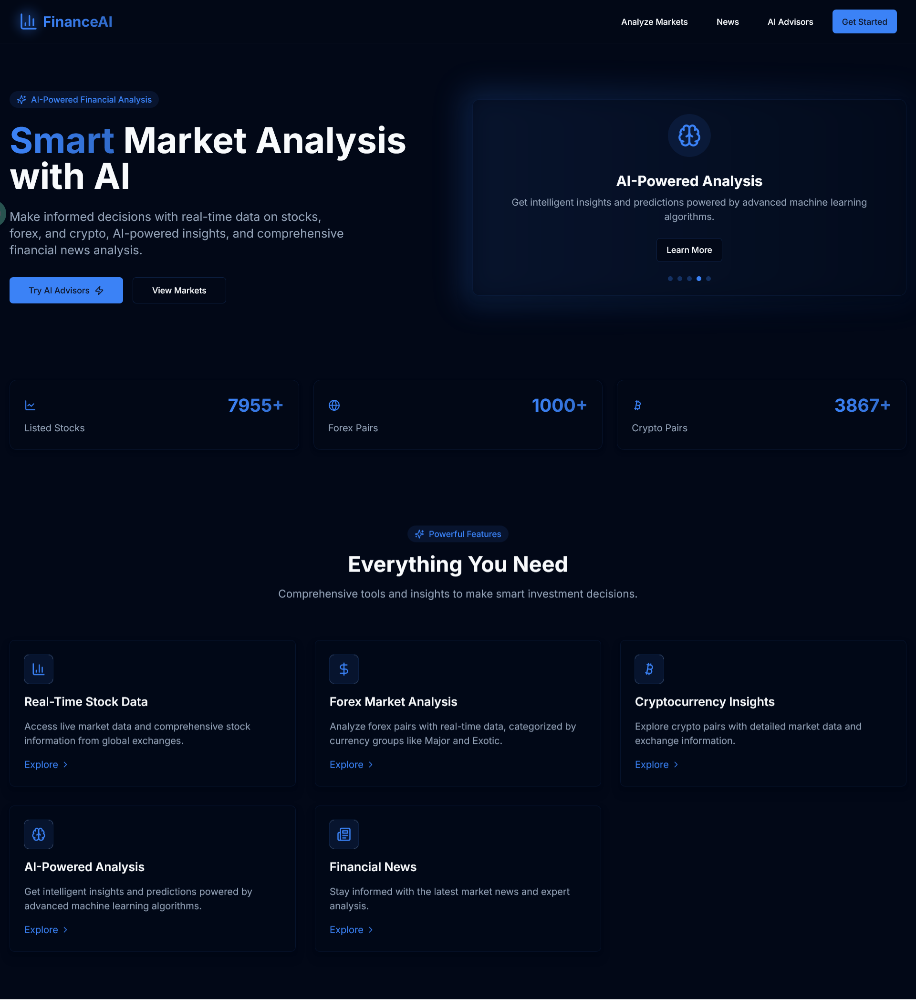

# FinanceAI

A comprehensive financial analysis platform built with Next.js that provides AI-powered insights for stocks, cryptocurrencies, and forex markets. The platform offers real-time market data, technical analysis, and personalized financial advice.

## 🌟 Features

### Market Analysis

- **Stocks Analysis**

  - Real-time stock market data from Twelve Data API
  - Technical indicators and patterns
  - AI-powered market sentiment analysis
  - Historical performance tracking
  - Stock list with curated selection of stocks
  - **Reddit Community Sentiment Analysis**: Real-time sentiment analysis from 20+ financial subreddits with relevance scoring

- **Cryptocurrency Analysis**

  - Live crypto market data
  - Technical analysis tools
  - Market sentiment indicators
  - Portfolio tracking
  - Real-time price updates
  - **Reddit Community Sentiment Analysis**: Cryptocurrency sentiment from crypto-focused subreddits

- **Forex Analysis**
  - Real-time forex rates from Twelve Data API
  - Currency pair analysis with 15+ technical indicators
  - Market trend analysis
  - Live forex pair prices (USD/JPY, EUR/USD)
  - **Reddit Community Sentiment Analysis**: Forex sentiment from currency trading subreddits with forex-specific pattern matching
  - **Advanced Forex Pattern Recognition**: Smart symbol detection for various forex pair formats (EUR/USD, EURUSD, Euro Dollar)

### AI-Powered Insights

- Personalized financial advice using Groq API and LLaMA 3 model
- Market sentiment analysis
- Trend prediction
- Risk assessment
- AI-driven recommendations for investments
- **Advanced Market Intelligence**:
  - Real-time news analysis and market alerts using Tavily Search
  - Geopolitical event impact assessment
  - Fundamental and technical analysis synthesis
  - Macroeconomic factor influence evaluation
  - Regulatory change impact analysis
  - Comprehensive market sentiment understanding
  - Cross-market correlation analysis

#### Advisors Architecture


### Financial News

- Up to 500 unique finance-related news articles
- Sentiment analysis for each article
- Multiple query coverage (finance, stocks, economy, banking, markets)
- Pagination with 12 articles per page
- Local storage caching for 1 hour
- Excludes cryptocurrency-related terms

### User Interface

- Modern, responsive design with shadcn/ui components
- Interactive charts and graphs using Chart.js and Recharts
- Real-time data updates
- Mobile-friendly interface
- Animated transitions with Framer Motion
- Dark/Light theme toggle with system preference detection
- Theme persistence across page refreshes

## 🛠️ Tech Stack

### Frontend

- **Framework:** Next.js 15
- **Language:** TypeScript
- **Styling:** Tailwind CSS
- **UI Components:** shadcn/ui, Radix UI
- **Charts:** Chart.js, Recharts
- **State Management:** SWR
- **Form Handling:** React Hook Form
- **Validation:** Zod
- **Animations:** Framer Motion
- **Icons:** Lucide React

### Backend

- **API:** Next.js API Routes
- **AI Integration:**
  - Groq API with LLaMA 3 model for financial insights
  - LangChain for AI processing
  - Tavily Search for real-time market intelligence
- **Data Processing:**
  - NewsAPI for financial news
  - Twelve Data API for market data
  - Reddit API for community sentiment analysis
- **Authentication:** Next.js Middleware

### Development Tools

- ESLint for code linting
- TypeScript for type safety
- PostCSS for CSS processing
- Tailwind CSS for styling

## 📁 Project Structure

```
ai-finance/
├── app/                    # Next.js app directory
│   ├── api/               # API routes
│   │   ├── crypto/        # Cryptocurrency data
│   │   ├── forex/         # Forex market data
│   │   ├── news/          # Financial news
│   │   ├── overview/      # Market overview data
│   │   ├── reddit/        # Reddit sentiment analysis
│   │   ├── market-intelligence/ # Advanced market intelligence
│   │   └── technical-indicators/ # Technical analysis
│   ├── choose-advisor/    # AI advisor selection
│   ├── choose-market/     # Market selection
│   ├── crypto/            # Crypto analysis pages
│   ├── cryptos/           # Crypto market pages
│   ├── cryptoadvisor/     # Crypto AI advisor
│   ├── forex/             # Forex analysis pages
│   ├── forexs/            # Forex market pages
│   ├── forexadvisor/      # Forex AI advisor
│   ├── news/              # News section
│   ├── stocks/            # Stock analysis pages
│   ├── stockadvisor/      # Stock AI advisor
│   ├── layout.tsx         # Root layout component
│   ├── page.tsx           # Home page
│   ├── globals.css        # Global styles
│   └── middleware.ts      # Next.js middleware
├── components/            # Reusable components
│   └── ui/               # UI components
│       ├── button.tsx
│       ├── card.tsx
│       └── other UI components
├── hooks/                # Custom React hooks
│   └── use-toast.ts      # Toast notification hook
├── lib/                  # Utility functions
│   ├── market-intelligence.ts # Market intelligence utilities
│   └── utils.ts          # Utility functions
├── public/               # Static assets
│   ├── manifest.json     # Web app manifest
│   └── favicon.png       # Site favicon
├── .env.local           # Environment variables
├── .eslintrc.json       # ESLint configuration
├── .gitignore          # Git ignore rules
├── components.json     # shadcn/ui configuration
├── next.config.js      # Next.js configuration
├── next-env.d.ts       # Next.js TypeScript declarations
├── package.json        # Project dependencies
├── postcss.config.js   # PostCSS configuration
├── tailwind.config.ts  # Tailwind CSS configuration
└── tsconfig.json       # TypeScript configuration
```

## 🌐 Live Demo

The project is deployed on render and can be accessed at:
[FinanceAI](https://financeai.onrender.com/)

### Screenshots

#### Front Page



#### Market Analysis Page 2


#### Market Analysis Page 3


#### Market Analysis Page 4


#### Market Analysis Page 5


#### Market Analysis Page 6


## 🚀 Getting Started

### Prerequisites

- Node.js (Latest LTS version recommended)
- npm or yarn package manager

### Installation

1. Clone the repository:

```bash
git clone https://github.com/RobinMillford/Ai-Finance.git
cd Ai-finance
```

2. Install dependencies:

```bash
npm install
# or
yarn install
```

3. Create a `.env.local` file in the root directory with required environment variables:

```env
NEXT_PUBLIC_NEWSAPI_KEY=your_newsapi_key
TWELVE_DATA_API_KEY=your_twelve_data_key
NEXT_PUBLIC_GROK_API_KEY=your_groq_api_key
NEXT_PUBLIC_TAVILY_API_KEY=your_tavily_api_key
```

4. Start the development server:

```bash
npm run dev
# or
yarn dev
```

The application will be available at `http://localhost:3000`

### Deployment

The project is configured for easy deployment on Vercel:

1. Push your code to a GitHub repository
2. Connect your repository to Vercel
3. Add your environment variables in the Vercel dashboard
4. Deploy!

Vercel will automatically build and deploy your application with each push to the main branch.

## 📊 Available Scripts

- `npm run dev` - Start development server
- `npm run build` - Build for production
- `npm run start` - Start production server
- `npm run lint` - Run ESLint

## 🤝 Contributing

1. Fork the repository
2. Create your feature branch (`git checkout -b feature/AmazingFeature`)
3. Commit your changes (`git commit -m 'Add some AmazingFeature'`)
4. Push to the branch (`git push origin feature/AmazingFeature`)
5. Open a Pull Request

## 📄 License

This project is licensed under the GNU General Public License v3.0 - see the [LICENSE](LICENSE) file for details.

## 👥 Authors

- Yamin Hossain - Initial work

## 🙏 Acknowledgments

- Next.js team for the amazing framework
- Radix UI and shadcn/ui for the accessible components
- LangChain for AI capabilities
- NewsAPI for financial news data
- Twelve Data API for market data
- Groq API and LLaMA 3 for AI insights
- Tavily Search for real-time market intelligence
- Reddit API for community sentiment analysis
