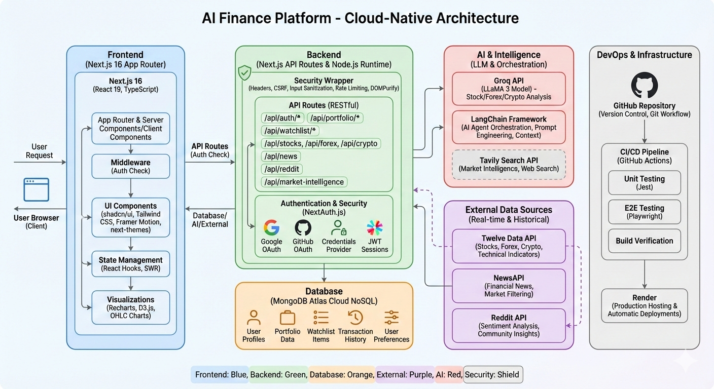

# FinanceAI - AI-Powered Financial Analysis Platform

[](https://nextjs.org/)
[](https://reactjs.org/)
[](https://www.typescriptlang.org/)
[](LICENSE)
[](https://github.com/RobinMillford/Ai-Finance)

> A production-ready financial analysis platform with a parallel multi-agent AI pipeline, real-time market data, portfolio management, and advanced search.


## Overview

FinanceAI combines real-time market data with AI-powered insights across crypto, stocks, and forex. Its multi-agent advisory pipeline plans once, runs specialist agents **in parallel**, and synthesizes a single expert response — delivering full market analysis in under 5 seconds.



## Key Features

### Multi-Agent AI Advisors

- **Parallel LangGraph Pipeline** — plan-once architecture: the supervisor classifies intent in a single structured call, then all needed specialists run concurrently via the Send API
- **3 Specialized Advisors**: Crypto, Forex, and Stock analysis
- **3 Specialist Agents + Planner**: Technical Analyst, Sentiment Analyst, Market Researcher
- **Deterministic Routing** — low-temperature planning model for stable agent selection
- **Domain-Aware Research** — per-market search allowlists so stock queries never pull from crypto news sites
- **Resilient by Design** — automatic retry with exponential backoff on rate limits, graceful degradation to single-agent fallback when planning fails
- **Real-time Streaming** — live agent status via SSE (`planning → working agents → final`)
- **Accurate Token Budgeting** — real BPE tokenizer (js-tiktoken) for history trimming

### Multi-Market Analysis

- **Stocks** — real-time quotes with technical indicators
- **Forex** — currency pair analysis and trends
- **Crypto** — cryptocurrency market tracking

### Portfolio Management

- Create and manage multiple portfolios
- Track holdings with real-time P&L calculations
- Analytics dashboard with interactive charts
- Export to CSV/PDF

### Watchlist System

- Track favorite assets across all markets
- Statistics and performance tracking
- Export watchlist data

### Advanced Search

- Command palette (⌘K / Ctrl+K)
- Real-time fuzzy search across all markets
- Recent items tracking
- Keyboard-first navigation

### Data Visualizations

- Portfolio value over time (area charts)
- Asset allocation (pie charts)
- P&L breakdown (bar charts)
- Market heatmap (sector performance)
- Correlation matrix (diversification analysis)
- OHLC price charts with time ranges

### Modern UI/UX

- Responsive design with dark/light theme support
- Smooth animations with Framer Motion
- Accessible (WCAG AA compliant)

## Tech Stack

### Frontend

| | |
|---|---|
| Framework | Next.js 16 (App Router) |
| Language | TypeScript 5.9 |
| Styling | Tailwind CSS v4 |
| UI Components | shadcn/ui |
| Animations | Framer Motion |
| Charts | Recharts |
| State | React Hooks, SWR |

### Backend & AI

| | |
|---|---|
| API | Next.js API Routes |
| Database | MongoDB Atlas |
| Authentication | NextAuth.js v4 |
| Agent Orchestration | LangGraph (plan → parallel dispatch → synthesize) |
| Tool Integration | LangChain |
| LLM Inference | Groq (`openai/gpt-oss-120b` synthesis · `openai/gpt-oss-20b` workers) |
| Search & Intelligence | Tavily API |
| Email | Resend API (password reset) |

### Data Sources

- **Market Data**: Twelve Data API (stocks, forex, crypto)
- **News**: NewsAPI
- **Community Sentiment**: Reddit API (15+ financial subreddits)
- **Market Intelligence**: Tavily Search API
- **Technical Indicators**: RSI, MACD, EMA, Bollinger Bands, ATR, ADX

### Development Tools

- **Testing**: Jest 30, React Testing Library, Playwright
- **E2E Testing**: Playwright (multi-browser + mobile)
- **CI/CD**: GitHub Actions
- **Security**: isomorphic-dompurify v3 (XSS prevention), axe-core

## Quick Start

### Prerequisites

- Node.js 18+ and npm
- MongoDB Atlas account (free tier available)
- API keys (see [Environment Variables](#environment-variables))

### Installation

```bash
git clone https://github.com/RobinMillford/Ai-Finance.git
cd Ai-Finance

npm install

cp .env.example .env.local
# Edit .env.local with your API keys

npm run dev
```

Open [http://localhost:3000](http://localhost:3000).

### Production

```bash
npm run build
npm start
```

## Environment Variables

Copy `.env.example` to `.env.local` and fill in your values:

```env
# Database
MONGODB_URI=your_mongodb_connection_string

# Authentication
NEXTAUTH_SECRET=your_nextauth_secret
NEXTAUTH_URL=http://localhost:3000

# AI — Multi-Agent System (required)
NEXT_PUBLIC_GROQ_API_KEY=your_groq_api_key

# Market Data (required)
NEXT_PUBLIC_TWELVEDATA_API_KEY=your_twelve_data_key
NEXT_PUBLIC_TAVILY_API_KEY=your_tavily_api_key
NEXT_PUBLIC_NEWS_API_KEY=your_news_api_key

# Email — password reset (optional, logs to console if unset)
RESEND_API_KEY=your_resend_key

# Reddit — social sentiment (optional)
REDDIT_CLIENT_ID=your_reddit_client_id
REDDIT_CLIENT_SECRET=your_reddit_client_secret
```

Optional AI tuning (all have sensible defaults):

```env
GROQ_SMART_MODEL=openai/gpt-oss-120b      # synthesis model
GROQ_FAST_MODEL=openai/gpt-oss-20b        # worker model
GROQ_ROUTING_TEMPERATURE=0.1              # planner determinism
AI_HISTORY_TOKEN_BUDGET=4000              # history trim budget
LLM_MAX_RETRIES=2                         # transient-error retries
```

### Getting API Keys

- **MongoDB**: [MongoDB Atlas](https://www.mongodb.com/cloud/atlas)
- **Groq**: [Groq Cloud](https://console.groq.com/)
- **Twelve Data**: [Twelve Data](https://twelvedata.com/)
- **NewsAPI**: [NewsAPI](https://newsapi.org/)
- **Tavily**: [Tavily](https://tavily.com/)
- **Resend**: [Resend](https://resend.com/)
- **Reddit**: [Reddit Apps](https://www.reddit.com/prefs/apps)

## Multi-Agent AI Architecture

The three advisors share one graph factory (`lib/ai/graph-factory.ts`) — each domain contributes only its prompts and tools:

```
User Query
    │
    ▼
Supervisor ── one structured call, temperature 0.1
    │         outputs a plan of 1-3 specialist agents
    │
    ├─▶ TechnicalAnalyst ─┐
    ├─▶ SentimentAnalyst ─┼── all planned agents run IN PARALLEL
    └─▶ MarketResearcher ─┘   (LangGraph Send API)
                              │
                              ▼
                 results merge into shared state.data
                              │
                              ▼
                    finalResponse (gpt-oss-120b)
                    synthesizes one expert answer
```

**Design principles:**

- **Plan once, fan out** — no supervisor round-trips between agents; a full analysis costs exactly 3 LLM hops regardless of how many agents are needed
- **Bounded context** — the planner never sees raw tool payloads; the synthesizer receives collected data + user query only
- **Fail soft** — planning errors fall back to a TechnicalAnalyst-only plan; transient provider errors retry automatically
- **Lean final input** — data flows through `state.data`, not through replayed message history, keeping synthesis within tight token budgets

**Example workflows:**

- "What's AAPL price?" → `[TechnicalAnalyst]`
- "AAPL price and recent news?" → `[TechnicalAnalyst, MarketResearcher]` in parallel
- "Full outlook with sentiment" → `[TechnicalAnalyst, SentimentAnalyst, MarketResearcher]` in parallel

## Project Structure

```
├── app/
│   ├── api/
│   │   ├── chat/                   # Crypto advisor API (SSE streaming)
│   │   ├── forex-chat/             # Forex advisor API
│   │   ├── stock-chat/             # Stock advisor API
│   │   ├── portfolio/              # Portfolio endpoints
│   │   ├── watchlist/              # Watchlist endpoints
│   │   ├── reddit/                 # Reddit sentiment
│   │   ├── market-intelligence/    # Tavily market intelligence
│   │   └── ...                     # stocks/, forex/, cryptos/, news/
│   ├── cryptoadvisor/              # Crypto advisor UI
│   ├── forexadvisor/               # Forex advisor UI
│   ├── stockadvisor/               # Stock advisor UI
│   └── ...                         # portfolio/, watchlist/, dashboard/
├── components/                     # React components (ui/, charts/)
├── lib/
│   ├── ai/
│   │   ├── config.ts               # Env-driven LLM configuration
│   │   ├── graph-factory.ts        # Shared advisor graph factory
│   │   ├── plan.ts                 # Plan normalization helpers
│   │   ├── stream-events.ts        # Graph → SSE event adapter
│   │   ├── utils.ts                # Tokenizer, trimming, retry, tool collection
│   │   ├── graph.ts                # Crypto advisor (thin config wrapper)
│   │   ├── stock-graph.ts          # Stock advisor (thin config wrapper)
│   │   ├── forex-graph.ts          # Forex advisor (thin config wrapper)
│   │   ├── __tests__/              # Unit tests (73 tests)
│   │   └── tools/
│   │       ├── financial.ts        # Crypto price & indicators
│   │       ├── forex.ts            # Forex quotes & indicators
│   │       ├── stock.ts            # Stock quotes & indicators
│   │       ├── social.ts           # Reddit sentiment
│   │       └── search.ts           # Tavily search (domain-configurable)
│   ├── rate-limiter.ts             # Shared in-memory rate limiter
│   ├── market-intelligence.ts      # Tavily market analysis
│   ├── mongodb.ts                  # DB connection
│   └── sanitize.ts                 # DOMPurify XSS sanitization
├── models/                         # MongoDB models
├── e2e/                            # Playwright E2E suites
├── middleware.ts                   # CSP nonces + auth middleware
└── .env.example                    # All env vars documented
```

## Scripts

```bash
npm run dev            # Start dev server with Turbopack
npm run build          # Production build
npm start              # Start production server
npm test               # Run unit tests
npm run test:watch     # Unit tests in watch mode
npm run test:coverage  # Unit tests with coverage report
npx playwright test    # Run E2E tests
```

## Testing & Quality Assurance

- **Unit Tests** (73): AI utilities, plan normalization, retry logic, rate limiter, export utils, auth
- **E2E Tests**: 6 Playwright suites — navigation, search, portfolio, watchlist, market pages — across Chrome/Firefox/Safari + mobile viewports
- **CI/CD**: Automated test → build → E2E on every push and PR
- **Coverage thresholds** enforced with Codecov reporting

## Security

- Secure authentication with NextAuth.js
- Per-request CSP nonces (no `unsafe-inline`/`unsafe-eval` in production)
- Rate limiting on all API routes
- Input sanitization with isomorphic-dompurify v3
- CSRF protection via NextAuth.js
- Environment variable validation at startup
- Secrets kept server-side; browser-facing keys restricted to public prefixes

## Roadmap

### Completed

- [x] Parallel multi-agent pipeline (plan-once, Send API fan-out)
- [x] Deterministic LLM routing with dedicated planning model
- [x] Domain-specific research search allowlists
- [x] Automatic retry with backoff + graceful planning degradation
- [x] Real BPE token budgeting (js-tiktoken)
- [x] Real-time SSE streaming with live agent status
- [x] Portfolio management, watchlist, command palette search
- [x] Data visualizations (6 chart types)
- [x] E2E + unit testing with CI/CD
- [x] Security hardening (nonce-based CSP, DOMPurify v3, rate limiting)

### In Progress

- [ ] Real-time price updates via WebSocket
- [ ] Price alerts and notifications

### Planned

- [ ] Streamed synthesis output to client
- [ ] Response caching for repeated queries
- [ ] Advanced backtesting with historical data
- [ ] Portfolio risk analytics (Sharpe ratio, beta, alpha)
- [ ] Multi-language support

## Contributing

Contributions are welcome!

1. Fork the repository
2. Create a feature branch (`git checkout -b feature/amazing-feature`)
3. Commit your changes (`git commit -m 'Add amazing feature'`)
4. Push to the branch (`git push origin feature/amazing-feature`)
5. Open a Pull Request

Please ensure tests pass (`npm test`) and documentation stays up to date.

## Author

**Yamin Hossain**

- LinkedIn: [Yamin Hossain](https://www.linkedin.com/in/yamin-hossain-38a3b3263)
- GitHub: [@RobinMillford](https://github.com/RobinMillford)

## Acknowledgments

- [Next.js](https://nextjs.org/) — React framework
- [LangGraph](https://langchain.com/langgraph) — Multi-agent orchestration
- [Groq](https://groq.com/) — Ultra-fast LLM inference
- [shadcn/ui](https://ui.shadcn.com/) — UI components
- [Recharts](https://recharts.org/) — Chart library
- [Twelve Data](https://twelvedata.com/) — Market data
- [Tavily](https://tavily.com/) — AI-powered search

## License

This project is licensed under the GNU General Public License v3.0 — see the [LICENSE](LICENSE) file for details.
